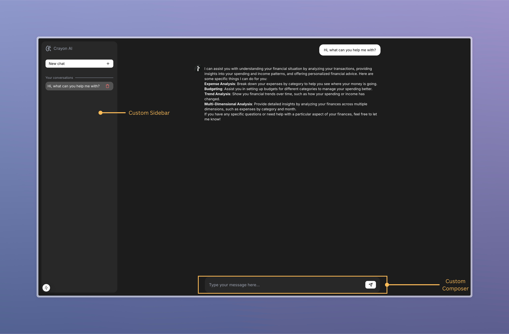

import Tabs from '@theme/Tabs';
import TabItem from '@theme/TabItem';

# Integrating Custom Components

In addition to customizing the existing components, you can also access and modify Crayon's state in your own custom components. This allows you
to mix your components with Crayon's components, or build a fully customized UI according to your needs. This guide presents an example of how you can build a custom
sidebar and a custom composer by integrating with Crayon's state management.



## Building a custom sidebar

The sidebar generally contains a CTA to start a new conversation and a list of existing conversations with the agent. This means that you will need to read and modify the
[`ThreadListState`](../../../reference/js/react-core/type-aliases/ThreadListState.md).

Crayon provides an easy way to do this through the [`useThreadListState`](../../../reference/js/react-core/functions/useThreadListState.md) and
[`useThreadListActions`](../../../reference/js/react-core/functions/useThreadListActions.md) hooks. The following code snippet demonstrates how you can create a custom sidebar
by accessing and modifying this state. For the sake of simplicity, this example uses tailwindcss for styling.

<Tabs groupId='frontend-lang'>

<TabItem value="ts" label="TypeScript">

```tsx
import { useThreadListActions, useThreadListState } from "@crayonai/react-core";
import { Button } from "@crayonai/react-ui";
import { BrainCircuit, PlusIcon, TrashIcon } from "lucide-react";

export const CustomSidebar = () => {
  const { threads, selectedThreadId } = useThreadListState();
  const { switchToNewThread, selectThread, deleteThread } =
    useThreadListActions();

  const newChatHandler = () => {
    // Clear thread state and unselect the selected thread so that the user can start a new chat
    switchToNewThread();
  };

  const deleteThreadHandler = (threadId: string) => {
    deleteThread(threadId);
  };

  return (
    <div className="w-[300px] h-full bg-opacity-5 filter bg-white rounded-2xl flex flex-col gap-8 p-4 text-gray-400">
      {/* Agent logo and name */}
      <div className="flex items-center gap-2">
        <BrainCircuit />
        <h1>Crayon AI</h1>
      </div>

      {/* New chat button */}
      <Button
        variant="primary"
        onClick={newChatHandler}
        iconRight={<PlusIcon />}
        className="justify-between"
      >
        New chat
      </Button>

      {/* Conversations section */}
      <section className="flex flex-col gap-2 flex-1">
        {/* Section header */}
        <div className="flex items-center flex-nowrap gap-2">
          <p className="text-xs">Your conversations</p>
          <div className="flex-1 border-y-[0.5px] border-gray-400" />
        </div>

        {/* Threads list container */}
        <div className="flex flex-col gap-2 flex-1">
          {threads.map((thread) => (
            // Thread
            <div
              key={thread.threadId}
              className={`px-2 py-1 filter hover:bg-white hover:bg-opacity-10 rounded-xl cursor-pointer flex items-center justify-between ${
                selectedThreadId === thread.threadId
                  ? "bg-white/20 text-white"
                  : "text-gray-300 hover:text-white"
              }`}
              onClick={() => selectThread(thread.threadId)}
            >
              <p className="line-clamp-1 text-sm">{thread.title}</p>

              {/* Delete thread button */}
              <Button
                variant="tertiary"
                iconRight={<TrashIcon className="text-red-400" />}
                size="small"
                onClick={() => deleteThreadHandler(thread.threadId)}
              />
            </div>
          ))}
        </div>
      </section>
    </div>
  );
};
```

</TabItem>

<TabItem value="js" label="JavaScript">

```jsx
import { useThreadListActions, useThreadListState } from "@crayonai/react-core";
import { Button } from "@crayonai/react-ui";
import { BrainCircuit, PlusIcon, TrashIcon } from "lucide-react";

export const CustomSidebar = () => {
  const { threads, selectedThreadId } = useThreadListState();
  const { switchToNewThread, selectThread, deleteThread } =
    useThreadListActions();

  const newChatHandler = () => {
    // Clear thread state and unselect the selected thread so that the user can start a new chat
    switchToNewThread();
  };

  const deleteThreadHandler = (threadId) => {
    deleteThread(threadId);
  };

  return (
    <div className="w-[300px] h-full bg-opacity-5 filter bg-white rounded-2xl flex flex-col gap-8 p-4 text-gray-400">
      {/* Agent logo and name */}
      <div className="flex items-center gap-2">
        <BrainCircuit />
        <h1>Crayon AI</h1>
      </div>

      {/* New chat button */}
      <Button
        variant="primary"
        onClick={newChatHandler}
        iconRight={<PlusIcon />}
        className="justify-between"
      >
        New chat
      </Button>

      {/* Conversations section */}
      <section className="flex flex-col gap-2 flex-1">
        {/* Section header */}
        <div className="flex items-center flex-nowrap gap-2">
          <p className="text-xs">Your conversations</p>
          <div className="flex-1 border-y-[0.5px] border-gray-400" />
        </div>

        {/* Threads list container */}
        <div className="flex flex-col gap-2 flex-1">
          {threads.map((thread) => (
            // Thread
            <div
              key={thread.threadId}
              className={`px-2 py-1 filter hover:bg-white hover:bg-opacity-10 rounded-xl cursor-pointer flex items-center justify-between ${
                selectedThreadId === thread.threadId
                  ? "bg-white/20 text-white"
                  : "text-gray-300 hover:text-white"
              }`}
              onClick={() => selectThread(thread.threadId)}
            >
              <p className="line-clamp-1 text-sm">{thread.title}</p>

              {/* Delete thread button */}
              <Button
                variant="tertiary"
                iconRight={<TrashIcon className="text-red-400" />}
                size="small"
                onClick={() => deleteThreadHandler(thread.threadId)}
              />
            </div>
          ))}
        </div>
      </section>
    </div>
  );
};
```

</TabItem>

</Tabs>

The hooks provide more state information and utilities that you can use for further customization. Detailed information about their API can be found in the
<ins>[API Reference](../../../reference/js/react-core/)</ins>

## Building a custom composer

Building a custom composer would be very similar to building a custom sidebar. The state that a composer modifies is the
[`ThreadState`](../../../reference/js/react-core/type-aliases/ThreadState.md) since you are adding and modifying messages in the
[`Thread`](../../../reference/js/react-core/type-aliases/Thread.md). To accomplish this, Crayon provides the
[`useThreadState`](../../../reference/js/react-core/functions/useThreadState.md) and [`useThreadActions`](../../../reference/js/react-core/functions/useThreadActions.md) hooks.

The following code snippet demonstrates an example of how you might use these hooks to build a custom composer:

<Tabs groupId='frontend-lang'>

<TabItem value="ts" label="TypeScript">

```tsx
import { useThreadActions, useThreadState } from "@crayonai/react-core";
import { Button } from "@crayonai/react-ui";
import { CircleX, SendIcon } from "lucide-react";
import { useState } from "react";

export const CustomComposer = () => {
  const [message, setMessage] = useState("");
  const { isRunning } = useThreadState();
  const { onCancel, processMessage } = useThreadActions();

  const handleMessageButton = (e: React.FormEvent<HTMLFormElement>) => {
    e.preventDefault();
    if (isRunning) {
      onCancel();
      return;
    }

    if (!message) return;

    processMessage({ role: "user", type: "prompt", message });
    setMessage("");
  };

  return (
    <div className="bg-opacity-5 bg-white rounded-2xl p-4 w-1/2 mx-auto">
      <form onSubmit={handleMessageButton} className="w-full flex items-center">
        <input
          className="w-full h-full bg-transparent outline-none text-white"
          placeholder="Type your message here..."
          value={message}
          onChange={(e) => setMessage(e.target.value)}
        />
        <Button
          variant="primary"
          iconRight={isRunning ? <CircleX /> : <SendIcon />}
          type="submit"
        />
      </form>
    </div>
  );
};
```

</TabItem>

<TabItem value="js" label="JavaScript">

```jsx
import { useThreadActions, useThreadState } from "@crayonai/react-core";
import { Button } from "@crayonai/react-ui";
import { CircleX, SendIcon } from "lucide-react";
import { useState } from "react";

export const CustomComposer = () => {
  const [message, setMessage] = useState("");
  const { isRunning } = useThreadState();
  const { onCancel, processMessage } = useThreadActions();

  const handleMessageButton = (e) => {
    e.preventDefault();
    if (isRunning) {
      onCancel();
      return;
    }

    if (!message) return;

    processMessage({ role: "user", type: "prompt", message });
    setMessage("");
  };

  return (
    <div className="bg-opacity-5 bg-white rounded-2xl p-4 w-1/2 mx-auto">
      <form onSubmit={handleMessageButton} className="w-full flex items-center">
        <input
          className="w-full h-full bg-transparent outline-none text-white"
          placeholder="Type your message here..."
          value={message}
          onChange={(e) => setMessage(e.target.value)}
        />
        <Button
          variant="primary"
          iconRight={isRunning ? <CircleX /> : <SendIcon />}
          type="submit"
        />
      </form>
    </div>
  );
};
```

</TabItem>

</Tabs>

## Putting it all together

You can then use the custom components along with Crayon's components (or create a custom version of all components) in your root component as follows:

```tsx
return (
  <ThemeProvider mode="dark">
    <ChatProvider
      threadListManager={threadListManager}
      threadManager={threadManager}
    >
      <Container logoUrl={logoUrl} agentName="Crayon">
        {/* Custom sidebar */}
        <CustomSidebar />
        <ThreadContainer>
          <MobileHeader />
          <ScrollArea>
            <Messages />
          </ScrollArea>
          {/* Custom composer */}
          <CustomComposer />
        </ThreadContainer>
      </Container>
    </ChatProvider>
  </ThemeProvider>
);
```

## Summary

1. **Custom Sidebar Integration**
   - The thread list can be managed using the `useThreadListState` and `useThreadListActions` hooks

2. **Custom Composer Integration**
   - The thread can be managed using the `useThreadState` and `useThreadActions` hooks

These customization options allow you to build a fully personalized chat interface while maintaining the core functionality of Crayon's state management system.

By following these patterns, you can create your own custom components that seamlessly integrate with Crayon's ecosystem while maintaining full control over the user interface and experience. Additionally, you can use the `useThreadState` and `useThreadActions` hooks to create custom components for displaying message lists, enabling a fully customized UI.
